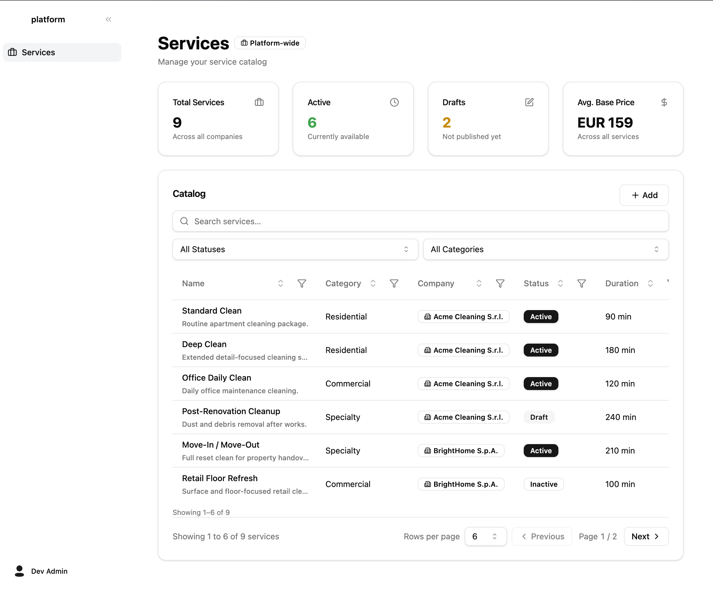

# Cleandrop — Services Catalog

A small services-catalog app: log in with a JWT, browse a paginated catalog with server-side search/filter/sort, and (as an admin) manage the catalog through a Sheet-based form. Refresh tokens rotate with reuse detection. OpenAPI spec is generated from the same Zod schemas that drive validation.

> The original challenge brief is in [docs/CHALLENGE.md](./docs/CHALLENGE.md).



## Run it

```bash
cp .env.example .env
docker compose up -d
```

That brings up Postgres, applies migrations, seeds the catalog, and starts the API + web. The compose lifecycle is `db (healthcheck) → migrate → seed → api → web`; later `docker compose up` calls are idempotent (seed checks for existing rows).

| Surface | URL |
|---|---|
| Web app | http://localhost:8080 |
| API | http://localhost:3000 |
| OpenAPI docs (Swagger UI) | http://localhost:3000/api/docs |
| OpenAPI JSON | http://localhost:3000/api/docs-json |
| Health | http://localhost:3000/healthz |

If those host ports clash with other services on your machine, override in `.env`:

```env
API_HOST_PORT=3001
WEB_HOST_PORT=8081
POSTGRES_HOST_PORT=5434
# Also update VITE_API_URL to match the API port — it is baked into the web
# bundle at build time, not read at runtime.
VITE_API_URL=http://localhost:3001
```

After changing `VITE_API_URL` you need `docker compose build web` so the new value is bundled.

## Seeded accounts

This README is the only place these credentials exist; there is no signup endpoint by design.

| Role | Email | Password |
|---|---|---|
| `admin` (full CRUD) | `admin@cleandrop.test` | `Cleandrop!Admin-2026` |
| `user` (read-only) | `user@cleandrop.test` | `Cleandrop!User-2026` |

Passwords are stored as bcrypt hashes (`bcrypt.hash(plaintext, 10)`).

## What you can do

As **`user`**: list the 9 seeded services, filter by status/category, search across name + description, sort by any column, paginate, see the summary cards (Total / Active / Drafts / Avg base price). Cannot create, edit, or delete.

As **`admin`**: everything above, plus a "+ Add" button on the Catalog header, a row-actions menu (Edit + Delete) on every row, and a confirmation dialog on delete. Mutations refresh both the list and the summary cards.

Role enforcement is in **both layers** — the UI hides the admin affordances, and the API returns 403 if a `user` calls a write endpoint directly.

## Architecture

```
cleandrop/
├── apps/
│   ├── api/                # NestJS 10 + Drizzle + Postgres
│   │   ├── src/
│   │   │   ├── auth/       # JWT guard, RolesGuard, refresh-token rotation
│   │   │   ├── services/   # catalog + summary
│   │   │   ├── companies/  # for the form's dropdown
│   │   │   ├── me/         # /me
│   │   │   ├── db/         # drizzle client + schema + fixtures + migrate/seed runners
│   │   │   └── config/     # Zod-validated env
│   │   ├── drizzle/        # generated migrations
│   │   ├── test/           # backend e2e against Testcontainers Postgres
│   │   └── Dockerfile      # multi-stage: deps → source → build / migrate / seed / runtime
│   └── web/                # Vite + React 18 + Tailwind + shadcn/ui + react-router + React Query
│       ├── src/
│       │   ├── components/ # AppShell, SummaryCards, ServiceFormSheet, DeleteServiceDialog, ui/*
│       │   ├── pages/      # Login, Services
│       │   ├── lib/        # axios w/ refresh interceptor, auth-store, query hooks, mutations
│       │   └── routes/     # RequireAuth
│       └── Dockerfile      # multi-stage: deps → build → nginx
├── packages/
│   └── shared/             # type-only: Zod schemas + types + helpers (formatMoney, formatDuration)
├── docs/
│   ├── CHALLENGE.md        # original brief
│   └── adr/                # design decisions (read these for "why")
├── docker-compose.yml      # db → migrate → seed → api → web
├── CONTEXT.md              # domain glossary + stack decisions
└── package.json            # Bun workspaces
```

**One shared package**, used by both web and API:
- Zod schemas drive **runtime validation** (`nestjs-zod` ValidationPipe), **TypeScript types** (`z.infer`), **OpenAPI docs** (`nestjs-zod`'s Swagger integration), and **frontend form validation** (react-hook-form's `zodResolver`).
- Money is integer cents throughout, single currency `EUR`. See [ADR 0001](./docs/adr/0001-money-as-integer-cents-single-currency.md).

**Auth**:
- Access JWT (15 min, HS256) in `localStorage`, sent as `Authorization: Bearer …`.
- Refresh token (256-bit opaque, base64url, 7 days) in `localStorage`; stored server-side as a SHA-256 hash.
- Refresh rotates: each `POST /auth/refresh` revokes the old row and issues a new one with `replaced_by_id` linking back. **Reuse detection cascade**: presenting an already-revoked refresh token revokes every refresh row for that user. See [ADR 0002](./docs/adr/0002-refresh-token-rotation-with-reuse-detection.md).
- Axios response interceptor performs **single-flight refresh** on 401: the first failure starts a refresh, concurrent failures piggyback on the same promise, queued requests retry exactly once.

**Validation, types, and docs from one Zod schema**. See [ADR 0003](./docs/adr/0003-zod-as-cross-stack-single-source-of-truth.md).

## API contract

Open the Swagger UI at http://localhost:3000/api/docs (no auth required to read the spec; click "Authorize" with a Bearer JWT to try endpoints live).

Quick tour:

| Method | Path | Auth | Notes |
|---|---|---|---|
| `POST` | `/auth/login` | none | Returns `{ accessToken, refreshToken, user }` |
| `POST` | `/auth/refresh` | none | Rotates; replaying a revoked token → cascade revoke + 401 |
| `POST` | `/auth/logout` | none | Revokes the presented refresh token (idempotent) |
| `GET` | `/me` | bearer | Echoes the user from the JWT |
| `GET` | `/services` | bearer | `?search=&status=&category=&sortBy=&sortDir=&page=&pageSize=` |
| `GET` | `/services/summary` | bearer | Aggregates for the four cards |
| `GET` | `/services/:id` | bearer | 404 on miss |
| `POST` | `/services` | bearer + `admin` | 201 |
| `PATCH` | `/services/:id` | bearer + `admin` | 200, 404 on miss |
| `DELETE` | `/services/:id` | bearer + `admin` | 204, 404 on miss |
| `GET` | `/companies` | bearer | For the form's dropdown |

## Tests

Backend e2e runs the full Nest app against a **real Postgres** via Testcontainers (one container per suite, ~15–20s wall-clock for the whole suite). No DB mocks.

```bash
# from the workspace root
bun --filter @cleandrop/api test:e2e
```

What's covered (45 tests across 5 suites):
- **auth** (7) — login happy + bad password + missing user + malformed body; `/me` valid / missing / malformed token.
- **refresh** (6) — login issues both tokens; rotation chain advances forward; reuse-detection cascade (`r1 → r2`; replay `r1` → 401 AND `r2` is dead); logout revokes (idempotent); unknown refresh → 401; malformed body → 400.
- **services** (15) — list with each filter, ILIKE search across name + description (case-insensitive), sort by each column with `id ASC` tiebreaker, 3-page pagination with no overlap, page-beyond-last returns empty + correct total, stable tiebreaker across requests, invalid `sortBy` → 400, 401 without bearer.
- **summary** (3) — 401 without bearer; counts + avg match the fixture (derived from `SEED_SERVICES`, so the test self-updates if a service is added); admin sees the same numbers as user.
- **services CRUD** (14) — write endpoints as admin (201/200/204), as user (403), no token (401), missing id (404 on PATCH/DELETE/GET-after-DELETE), malformed body (400), non-existent companyId (404). Also covers `GET /companies` (alphabetised + 401 without bearer).

Prerequisites: Docker daemon running (Testcontainers needs it).

## Design decisions

Short ADRs that explain why things are the way they are:

- [ADR 0001 — Money as integer cents, single hardcoded EUR](./docs/adr/0001-money-as-integer-cents-single-currency.md)
- [ADR 0002 — Refresh-token rotation with reuse detection](./docs/adr/0002-refresh-token-rotation-with-reuse-detection.md)
- [ADR 0003 — Zod as cross-stack single source of truth](./docs/adr/0003-zod-as-cross-stack-single-source-of-truth.md)

Domain glossary and full stack decisions: [CONTEXT.md](./CONTEXT.md).

## Tech stack

| Layer | Stack |
|---|---|
| Runtime / package manager | Bun 1.1+ |
| Backend | NestJS 10 (TypeScript) |
| ORM | Drizzle 0.33 |
| Database | PostgreSQL 16 |
| Validation | Zod via `nestjs-zod` (one schema → validation + types + OpenAPI + frontend form) |
| Auth | `@nestjs/jwt` (HS256), bcryptjs for password hashing, SHA-256 for refresh-token hashes |
| Tests (backend) | Jest + supertest + Testcontainers |
| OpenAPI | `@nestjs/swagger` + `nestjs-zod` Swagger patch, Swagger UI at `/api/docs` |
| Frontend | Vite 5 + React 18 + react-router + Tailwind + shadcn/ui + React Query + react-hook-form |
| Dev environment | Docker compose (Postgres + migrate + seed + api + web) |

## Notes for the evaluator

- **No signup endpoint.** Use the seeded accounts above. Auth is a JWT issuance flow, not a registration flow.
- The `+ Add` button and row-actions menu only appear as `admin`. The API also enforces this; calling `POST /services` as `user` returns 403 even if you bypass the UI.
- Filter / sort / page / search state lives in the URL — refresh-friendly and deep-link friendly.
- Average price renders as `EUR 159` (no decimals on the card) but the underlying value is `15889` cents — exact.
- Sign out lives in the sidebar footer (small icon button) and posts to `/auth/logout` before clearing local state.

## Common follow-ups

- **Browser shows CORS errors after changing ports.** You changed `API_HOST_PORT` but forgot to update `VITE_API_URL` and rebuild web. Run `docker compose build web` after edits.
- **Tests fail with "could not start container".** Docker daemon must be running and the socket reachable (`docker info` should succeed).
- **Ports 3000 / 5432 / 8080 already in use.** Override in `.env` (see above) and rebuild the web image if you change `VITE_API_URL`.
